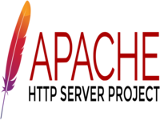
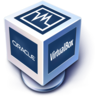
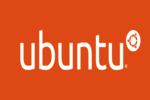

## Basic Terminology

### What is a web server? 

A webserver is software run by your website hosting provider so that visitors can view the web pages on your site. Many WordPress hosting providers use Apache.

**On the hardware side:**
A web server is a computer that stores web server software and a website's component files (for example, HTML documents, images, CSS stylesheets, and JavaScript files). A web server connects to the Internet and supports physical data interchange with other devices connected to the web.

**On the software side:**
A web server includes several parts that control how web users access hosted files. At a minimum, this is an HTTP server. An HTTP server is software that understands URLs (web addresses) and HTTP (the protocol your browser uses to view webpages). An HTTP server can be accessed through the domain names of the websites it stores, and it delivers the content of these hosted websites to the end user's device.

### What is Apache? 

Is a free and open-source cross-platform web server software, released under the terms of Apache License 2.0. Apache is developed and maintained by an open community of developers under the auspices of the Apache Software Foundation. Apache supports a variety of features, many implemented as compiled modules which extend the core functionality. These can range from authentication schemes to supporting server-side programming languages such as Perl, Python, Tcl and PHP. 

### What are some different web server applications?

| Application Name           | license                            | Project's Website                                                                       |
| -------------------------- | ---------------------------------- | --------------------------------------------------------------------------------------- |
| Microsoft (IIS)            | Part of Windows NT (same license)) | [example 1](https://www.iis.net)                                                        |
| Lighttpd                   | Open Source revised BSD license    | [example 2](http://www.lighttpd.net/)                                                   |
| Sun Java System Web Server | OTN Developer License              | [example 3](https://www.oracle.com/middleware/technologies/webtier.html#iplanet-server) |

**Microsoft (IIS)**

The Internet Information Server (IIS) is a high performance Web Server from Microsoft. This web server runs on Windows NT/2000 and 2003 platforms ( and may be on upcoming new Windows version also). IIS comes bundled with Windows NT/2000 and 2003; Because IIS is tightly integrated with the operating system so it is relatively easy to administer it.

**Lighttpd**

The lighttpd, pronounced lighty is also a free web server that is distributed with the FreeBSD operating system. This open source web server is fast, secure and consumes much less CPU power. Lighttpd can also run on Windows, Mac OS X, Linux and Solaris operating systems.

**Sun Java System Web Server**

This web server from Sun Microsystems is suited for medium and large websites. Though the server is free it is not open source. It however, runs on Windows, Linux and Unix platforms. The Sun Java System web server supports various languages, scripts and technologies required for Web 2.0 such as JSP, Java Servlets, PHP, Perl, Python, Ruby on Rails, ASP and Coldfusion etc. It is currently known as Oracle iPlanet Web Server.

### What is virtualization?

Is the act of creating a virtual version of something at the same abstraction level, including virtual computer hardware platforms, storage devices, and computer network resources. Another explanation could be that virtualization uses software to create an abstraction layer over computer hardware that allows the hardware elements of a single computer—processors, memory, storage and more—to be divided into multiple virtual computers, commonly called virtual machines (VMs).

### What is virtualbox?

Is cross-platform virtualization software that allows users to extend their existing computer to run multiple operating systems including Microsoft Windows, Mac OS X, Linux, and Oracle Solaris, at the same time. Was originally created by InnoTek Systemberatung GmbH, which was acquired by Sun Microsystems in 2008, which was in turn acquired by Oracle in 2010. 

### What is a virtual machine?
Is a digital version of a physical computer. Virtual machine software can run programs and operating systems, store data, connect to networks, and do other computing functions, and requires maintenance such as updates and system monitoring. It works as a separate independent machine, but it runs as a process on your host operating system. It's a convenient way to dedicate a portion of your computer resources to a specific task or software.

### What is Ubuntu Server?

Ubuntu Server is a server operating system, developed by Canonical and open source programmers around the world, that works with nearly any hardware or virtualization platform. It can serve up websites, file shares, and containers, as well as expand your company offerings with an incredible cloud presence.

### What is a firewall?

A Firewall is a network security device that monitors and filters incoming and outgoing network traffic based on an organization’s previously established security policies. At its most basic, a firewall is essentially the barrier that sits between a private internal network and the public Internet. A firewall’s main purpose is to allow non-threatening traffic in and to keep dangerous traffic out. Firewalls, and especially Next Generation Firewalls, focus on blocking malware and application-layer attacks, along with an integrated intrusion prevention system (IPS), these Next Generation Firewalls can react quickly and seamlessly to detect and react to outside attacks across the whole network. They can set policies to better defend your network and carry out quick assessments to detect invasive or suspicious activity, like malware, and shut it down.

### What is SSH?

The Secure Shell Protocol is a cryptographic network protocol for operating network services securely over an unsecured network. Its most notable applications are remote login and command-line execution. SSH applications are based on a client–server architecture, connecting an SSH client instance with an SSH server. SSH also refers to the suite of utilities that implement the SSH protocol. Secure Shell provides strong password authentication and public key authentication, as well as encrypted data communications between two computers connecting over an open network, such as the internet.