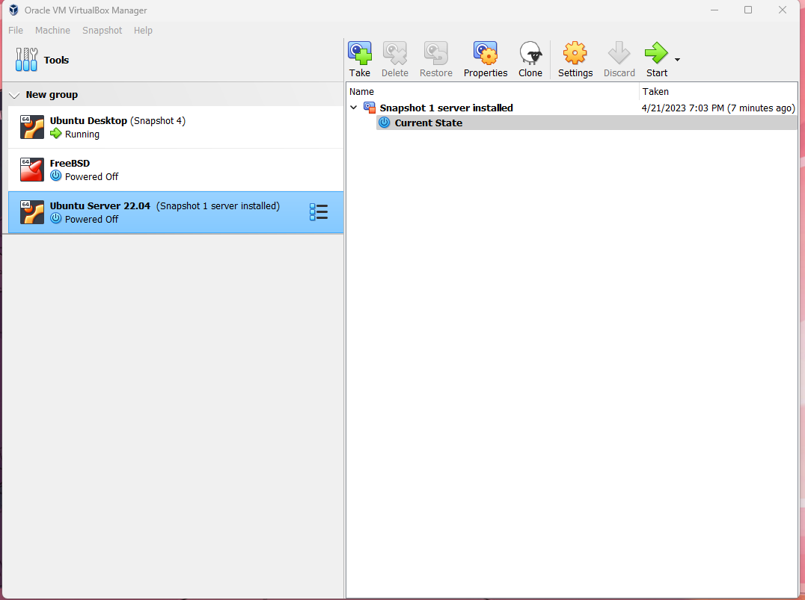
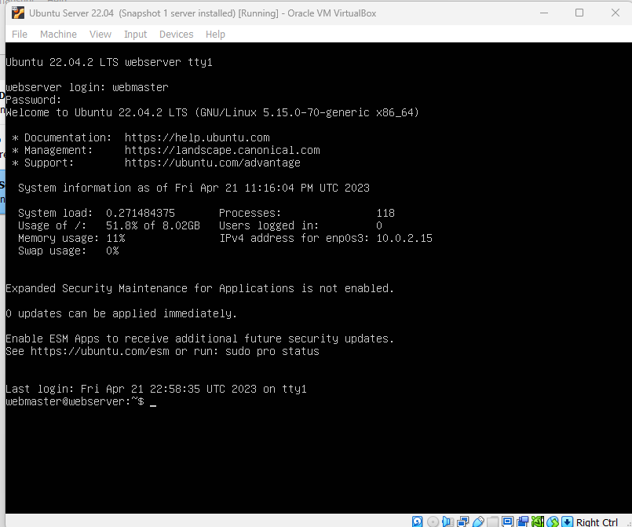
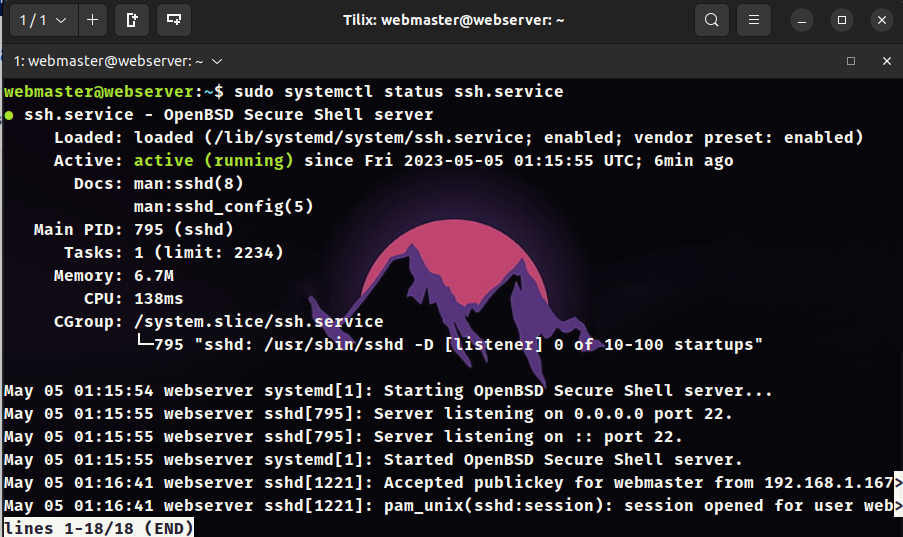
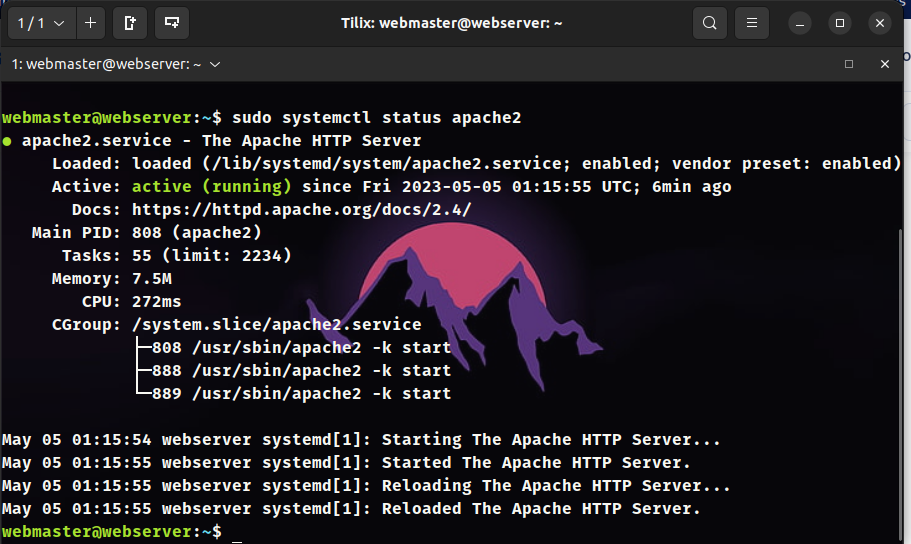
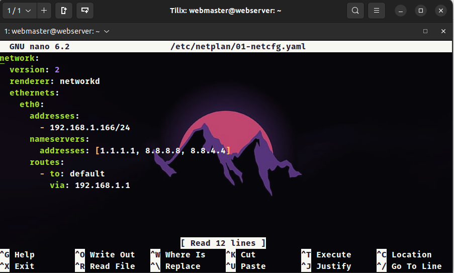
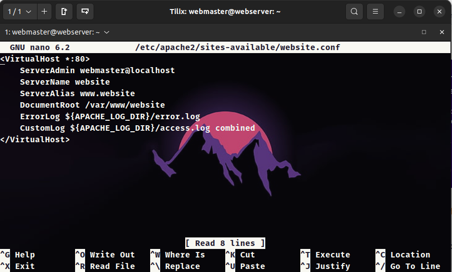
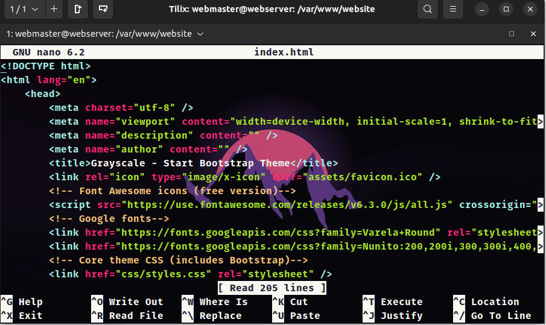
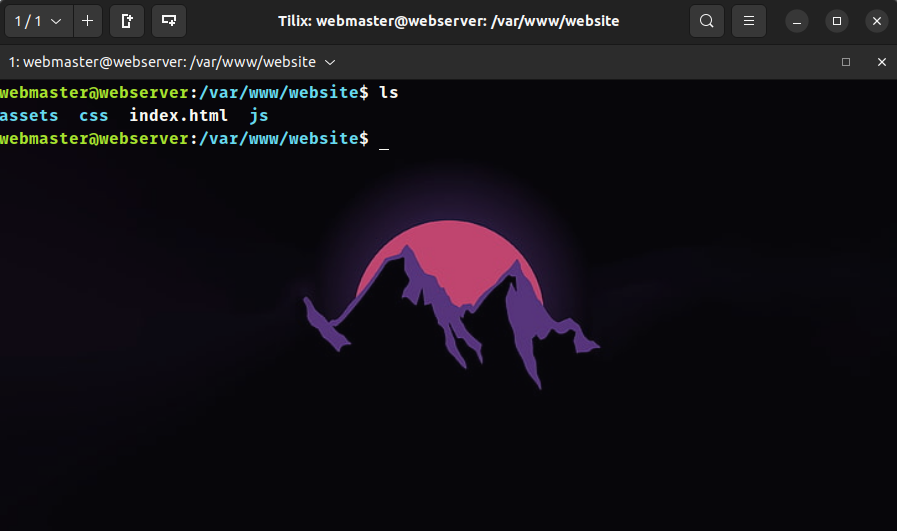
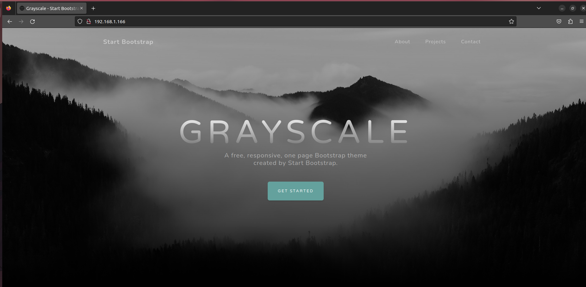

# Final Project Ubuntu Server

## Ubuntu Installed  

## Ubuntu Server Login 

## Firewall Status

## SSH Status 

## Apache Status

## Netplan Configuration

## Website Configuration 

## Index.html file 

## Website Directory 

## Website In Browser

