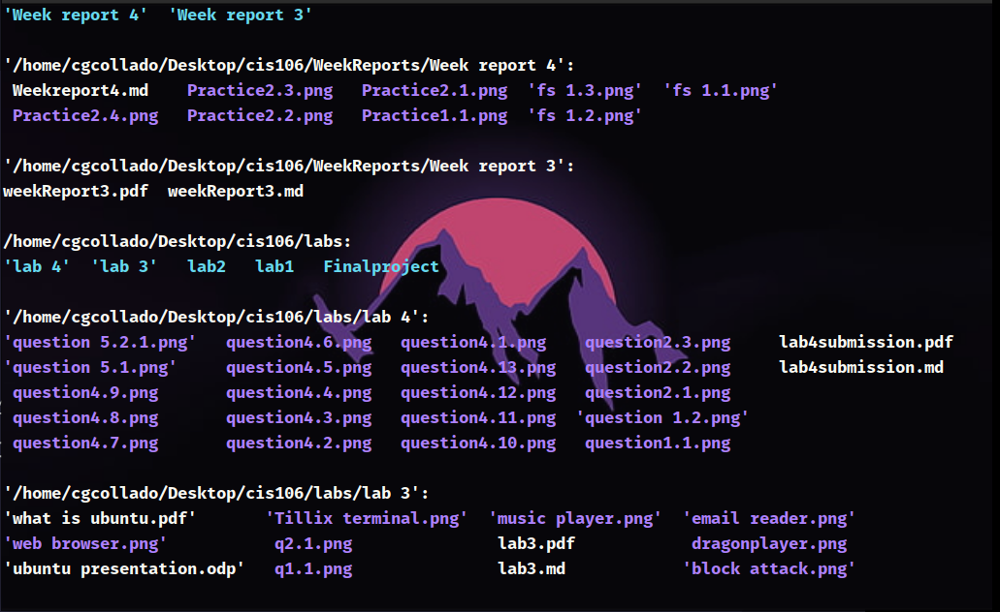

# Week Report 4

## Practice 1

## Practice 2

## Practice 3

## Linux file System

## All Commands

| Command | What it does                                              | Syntax                                | Example            |
| ------- | --------------------------------------------------------- | ------------------------------------- | ------------------ |
| pwd     | Display current directory                                 | `pwd`                                 | `pwd`              |
| cd      | It change the current working directory.                  | `cd` + `destination`                  | `cd /Home`         |
| ls      | list the content of a given directory or directory itself | `ls` + `option` + `directory to list` | `ls -a /Downloads` |

## Basic Terminology

* **File system**
 
 A file system is a set of data structures, interfaces, abstractions, and APIs that work together to manage any type of file on any type of storage device, in a consistent manner. Each operating system uses a particular file system to manage the files.

* **Current directory**
  
The current directory is the directory or folder where you are currently working.

* **Parent directory**

Refers to the directory above another directory. Every directory, except the root directory, lies beneath another directory. The higher directory is called the parent directory, and the lower directory is called a subdirectory.

* **The difference between your home directory and the home directory**
  
The home directory is in reference of the root directory were all the main files of the OS are stored. *My home directory* is a subdirectory of the root directory.

* **Pathname**
  
*Pathname* indiacates the location of a file. It does work like an address givin the exact location of a file. Is a specific label for a file's directory location while within an operating system.

* **Relative path**
  
Is use when the file or directory is inside of the current working directory so no absolute path is required to locate the directory.

* **Absolute path**

Is use to find the location of a file or directory from the root of the file system.
