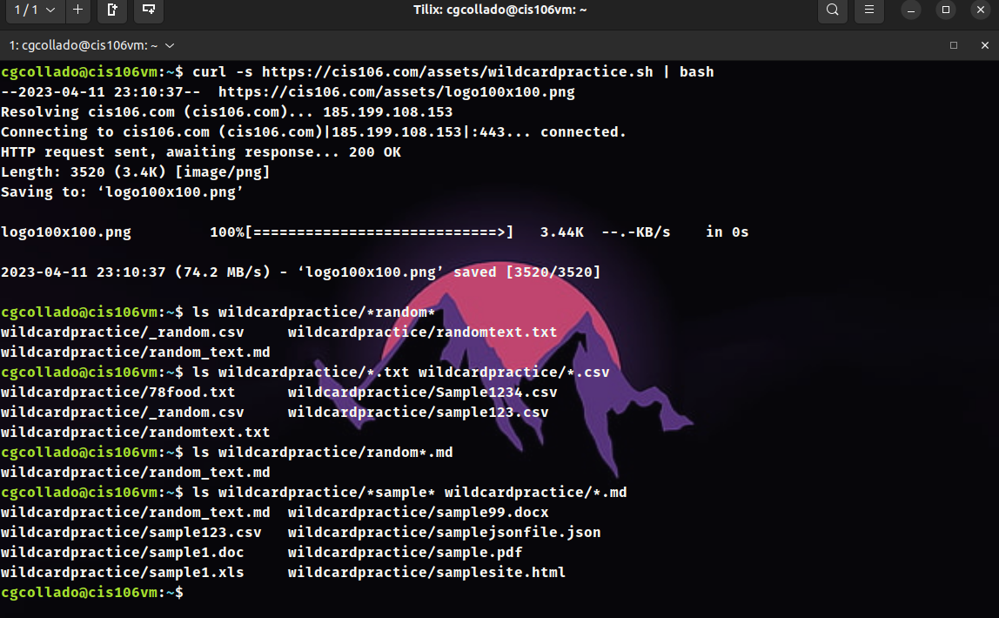
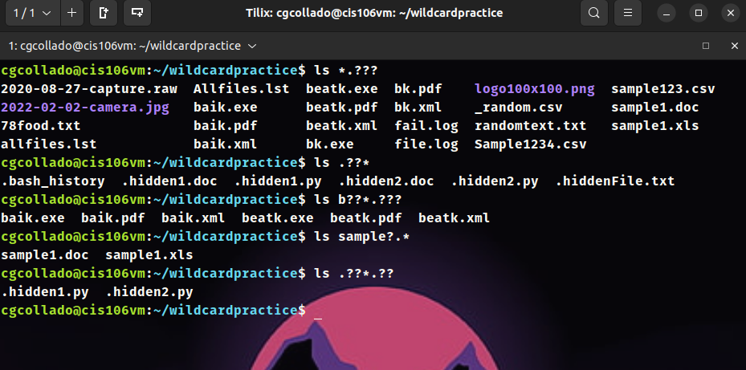
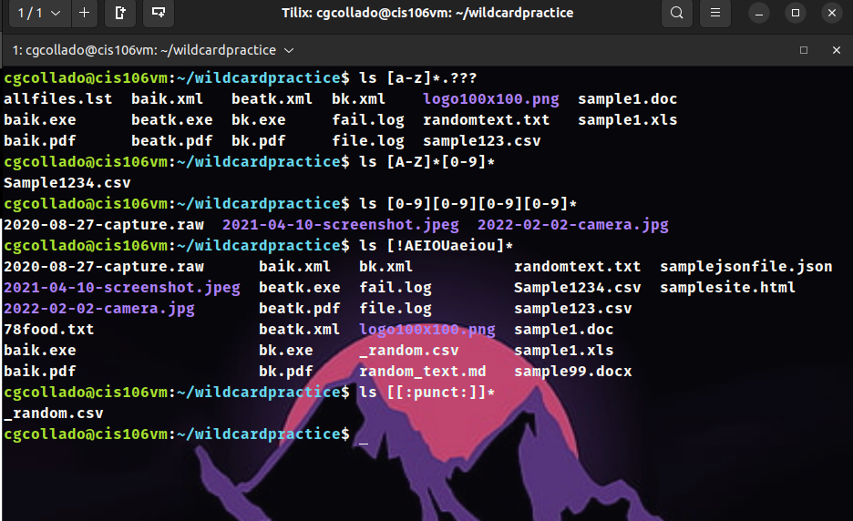
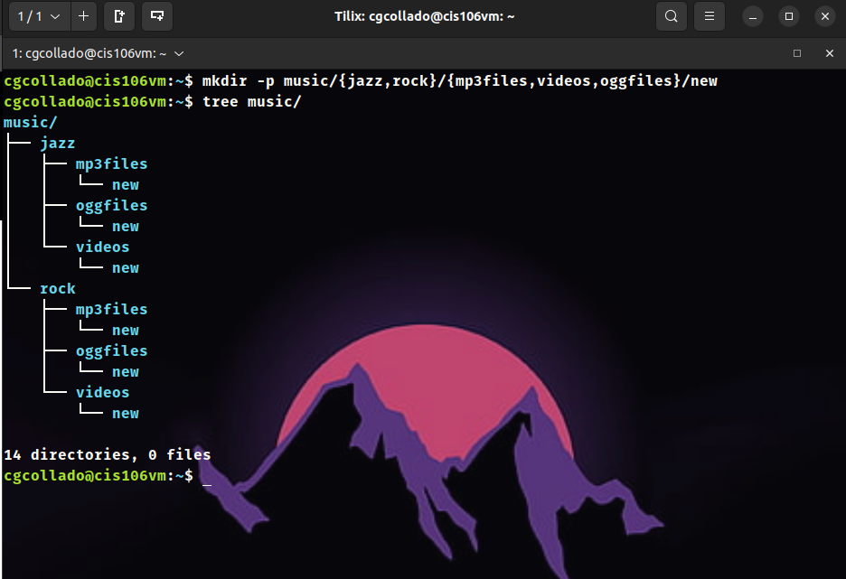

# Week Report 6

## Wildcard 

### * Wildcard 

The `*` wildcard will matches any character or number after the asterisk. Mostly use to find files and directories with a condition.
**Examples:** 
* `ls -a *.txt`  - To list all the text files in a directory
* `ls -a f*.txt` - To list all the text files starting with letter *f* 
* `mv ~/Documents/*.mp3 ~/Downloads/Music` - To move all the mp3 files in the documents folder to the Music folder inside Downloads

### ? Wildcard

The `?` wildcard will matches a single character or number that can go with the condition asked between numbers and letters.
**Examples:**
* `ls dir?.txt` - To list all the text files staring with *dir* and match anything after that.
* `ls music.???` - To list all the files with the name *music* with any extension that includes 3 characters or digits.
* `rm sample.???` - To remove all the files with the name *sample* with any extension that includes 3 characters or digits.

### [ ] Wildcard

The `[]` wildcard will match a set of characters or number of the files we are looking for. 
**Examples:**
* `ls file[0-9]*` - To list all the files with the name *file* and any number after.
* `ls f[a-z]n*.txt` - To list all the text files starting with *f* following by any lowercase letter and letter *n*.
* `cp log[0-9][1].log` - To copy all the log files containing a number between *0-9* first and *1* after.

## Brace Expansion

The `{}` brace expansion is use to generate multiple directories and files at the same time as well as creating multiple files with a set of conditions and to remove files with specific conditions.
**Examples:**
* `mkdir ~/music/{mp3,mp4}/{track,samples}` - This command will create a directory named *music* inside will create *mp3* and *mp4* and inside this two will also create *track* and *samples*
* `touch website{1..10}.html` - This command will create 10 html files named *website* with each designated number after website.
* `rm website{1..10}.html` - This command will remove all the html files named *website* that have a number from 1 to 10.

## Practice 1

## Practice 2

## Practice 3 

# Practice 4

