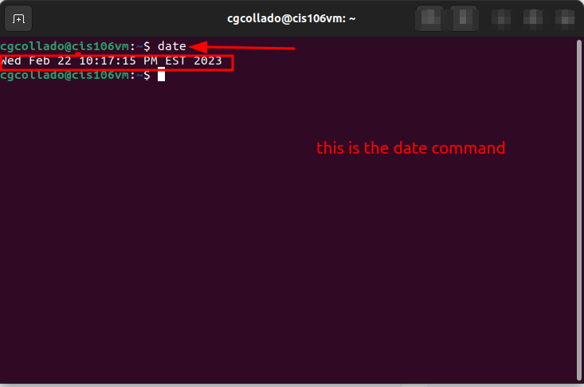
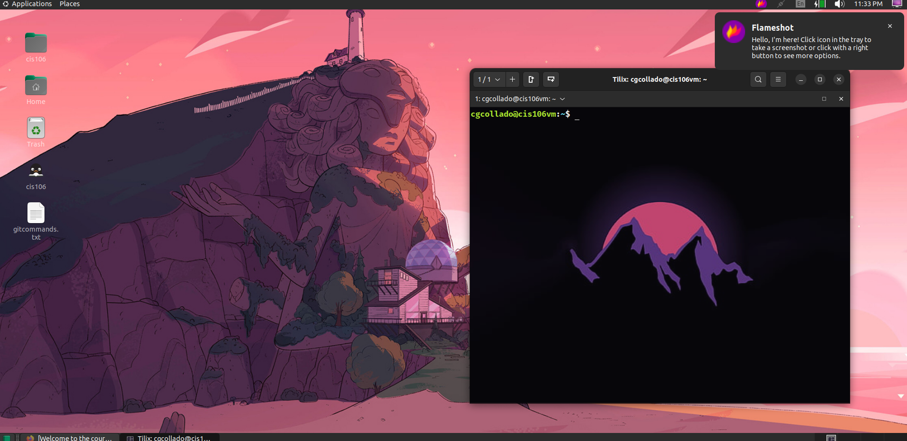

# Lab 3 Submission 

## Question 1

## Question 2

## Question 3

| Program purpose     | Package Name               | Version                            |
| ------------------- | -------------------------- | ---------------------------------- |
| Play a tetris game  | Blockattack                | 2.7.0-1                            |
| Play a video file   | dragonplayer               | 4:21.12.3-0ubuntu1                 |
| Browse the internet | dillo and epiphany-browser | 3.0.5-7build1 and 42.4-0ubuntu1    |
| Read your email     | geary                      | 40.0-2                             |
| Play music          | clementine                 | 1.4.0~rc1+git347-gfc4cb6fc7+dfsg-2 |

## Question 4

| command | what it does                                                                                                                        |
| ------- | ----------------------------------------------------------------------------------------------------------------------------------- |
| echo    | print a text                                                                                                                        |
| fortune | it does print a random text or random questions with an answer.                                                                     |
| cowsay  | prints any text with a graphic of a cow                                                                                             |
| lolcat  | print commands in different colors.                                                                                                 |
| figlet  | this command creates larger text with design, has different functions to locate the text in many places in the command line.        |
| toilet  | command to change that allow us to modified the text in many ways and add colors. it let us flip the text and put it backwards too! |
| rig     | this command pulls up peoples name, address and phone numnber area code (rest of the number is blocked)                             |

